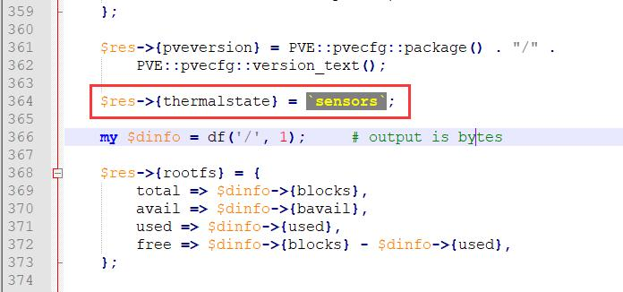
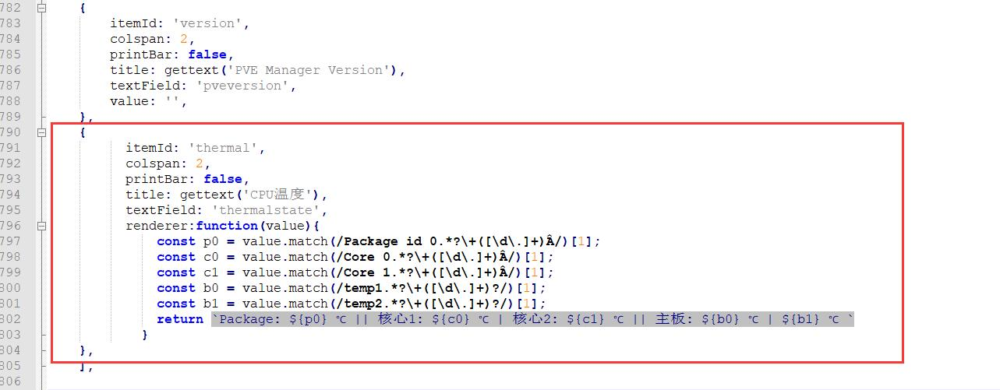
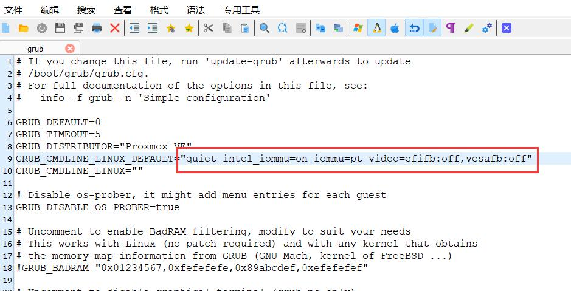
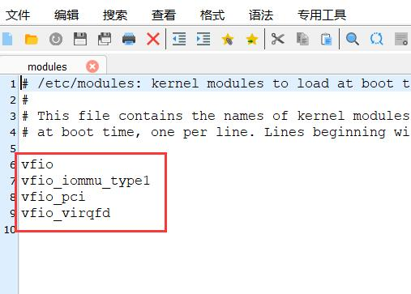
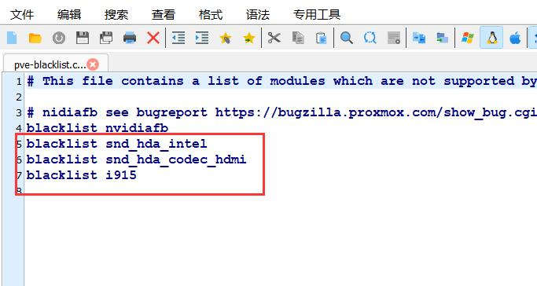

## Proxmox VE 7.0 换源

#### SSH登录到pve后台，然后一条一条的执行命令

#### 1.处理掉企业源
```
rm -rf /etc/apt/sources.list.d/pve-install-repo.list
```

```
echo "#deb https://enterprise.proxmox.com/debian/pve Bullseye pve-enterprise" > /etc/apt/sources.list.d/pve-enterprise.list
```


#### 2.开始换源

```
wget https://mirrors.ustc.edu.cn/proxmox/debian/proxmox-release-bullseye.gpg -O /etc/apt/trusted.gpg.d/proxmox-release-bullseye.gpg
```

```
echo "deb https://mirrors.ustc.edu.cn/proxmox/debian/pve bullseye pve-no-subscription" > /etc/apt/sources.list.d/pve-no-subscription.list
```
```
echo "deb https://mirrors.ustc.edu.cn/proxmox/debian/ceph-pacific bullseye main" > /etc/apt/sources.list.d/ceph.list
```

```
sed -i.bak "s#http://download.proxmox.com/debian#https://mirrors.ustc.edu.cn/proxmox/debian#g" /usr/share/perl5/PVE/CLI/pveceph.pm
```
```
sed -i.bak "s#ftp.debian.org/debian#mirrors.aliyun.com/debian#g" /etc/apt/sources.list
```
```
sed -i "s#security.debian.org#mirrors.aliyun.com/debian-security#g" /etc/apt/sources.list
```
```
echo "deb http://download.proxmox.com/debian/pve bullseye pve-no-subscription" >>  /etc/apt/sources.list
```


#### 3.最后更新
```
apt update && apt dist-upgrade -y
```


***


##  Proxmox VE 7.0 关订阅提示

#### 1.WinSCP登录到PVE，编辑打开这个文件：/usr/share/javascript/proxmox-widget-toolkit/proxmoxlib.js


#### 2.搜索'active'，找到这一段：

```
			.data.status.toLowerCase() !== 'active') {
			Ext.Msg.show({
			    title: gettext('No valid subscription'),
			    icon: Ext.Msg.WARNING,
			    message: Proxmox.Utils.getNoSubKeyHtml(res.data.url),
			    buttons: Ext.Msg.OK,
			    callback: function(btn) {
				if (btn !== 'ok') {
				    return;
				}
				orig_cmd();
			    },
			});
		    } else {
			orig_cmd();
		    }
```


#### 3.直接删掉其中几行，变成如下：

```
			.data.status.toLowerCase() !== 'active') {
				orig_cmd();
		    } else {
			orig_cmd();
		    }

```


#### 4.最后保存即可。


***


## Proxmox VE 主界面添加温度

#### 1.登录PVE的SSH，执行命令安装sensors：
```
apt-get install lm-sensors
```


#### 2.探测下温度，执行：(一路yes，回车)
```
sensors-detect
```

#### 3.获取温度信息，执行：sensors


ACPI interface那里是主板温度：temp1和temp2 (主板温度可不管)

ISA adapter那里是CPU温度：Core0和Core1 (几个核心就是显示几个，演示机只有双核，所以只有2个) 


#### 4.WinSCP登录到PVE，修改这个文件：/usr/share/perl5/PVE/API2/Nodes.pm 

(我习惯于下载到本地用Notepad++修改)

搜索：
```
$res->{pveversion} = PVE::pvecfg::package()
```

在这个定义的下方添加：
```
$res->{thermalstate} = `sensors`;
```

结果如图：




修改完保存，然后塞回路径。


#### 5.修改这个文件：/usr/share/pve-manager/js/pvemanagerlib.js (建议备份，万一自己改炸就不好了。)

(我习惯于下载到本地用Notepad++修改)

搜索PVE Manager Version


在这个定义的下方添加一个定义：

```
	{
          itemId: 'thermal',
          colspan: 2,
          printBar: false,
          title: gettext('CPU温度'),
          textField: 'thermalstate',
          renderer:function(value){
              const p0 = value.match(/Package id 0.*?\+([\d\.]+)Â/)[1];
              const c0 = value.match(/Core 0.*?\+([\d\.]+)Â/)[1];
              const c1 = value.match(/Core 1.*?\+([\d\.]+)Â/)[1];
              const b0 = value.match(/temp1.*?\+([\d\.]+)?/)[1];
              const b1 = value.match(/temp2.*?\+([\d\.]+)?/)[1];
              return `Package: ${p0} ℃ || 核心1: ${c0} ℃ | 核心2: ${c1} ℃ || 主板: ${b0} ℃ | ${b1} ℃ `
            }
    },
```

结果如图：


因为我是双核心，所以只写了2个核心的温度参数。


如果不要加入主板温度，就是这样：
```
	{
          itemId: 'thermal',
          colspan: 2,
          printBar: false,
          title: gettext('CPU温度'),
          textField: 'thermalstate',
          renderer:function(value){
              const p0 = value.match(/Package id 0.*?\+([\d\.]+)Â/)[1];
              const c0 = value.match(/Core 0.*?\+([\d\.]+)Â/)[1];
              const c1 = value.match(/Core 1.*?\+([\d\.]+)Â/)[1];
              return `Package: ${p0} ℃ || 核心1: ${c0} ℃ | 核心2: ${c1} ℃ `
            }
    },
```


如果是四核心的就是这样：

```         
	{
          itemId: 'thermal',
          colspan: 2,
          printBar: false,
          title: gettext('CPU温度'),
          textField: 'thermalstate',
          renderer:function(value){
              const p0 = value.match(/Package id 0.*?\+([\d\.]+)Â/)[1];
              const c0 = value.match(/Core 0.*?\+([\d\.]+)Â/)[1];
              const c1 = value.match(/Core 1.*?\+([\d\.]+)Â/)[1];
              const c2 = value.match(/Core 2.*?\+([\d\.]+)Â/)[1];
              const c3 = value.match(/Core 3.*?\+([\d\.]+)Â/)[1];
              const b0 = value.match(/temp1.*?\+([\d\.]+)?/)[1];
              const b1 = value.match(/temp2.*?\+([\d\.]+)?/)[1];
              return `Package: ${p0} ℃ || 核心1: ${c0} ℃ | 核心2: ${c1} ℃ | 核心3: ${c2} ℃ | 核心4: ${c3} ℃ || 主板: ${b0} ℃ | ${b1} ℃ `
            }
    },	  
```


如果是四核心不要加入主板温度就是这样：

```         
	{
          itemId: 'thermal',
          colspan: 2,
          printBar: false,
          title: gettext('CPU温度'),
          textField: 'thermalstate',
          renderer:function(value){
              const p0 = value.match(/Package id 0.*?\+([\d\.]+)Â/)[1];
              const c0 = value.match(/Core 0.*?\+([\d\.]+)Â/)[1];
              const c1 = value.match(/Core 1.*?\+([\d\.]+)Â/)[1];
              const c2 = value.match(/Core 2.*?\+([\d\.]+)Â/)[1];
              const c3 = value.match(/Core 3.*?\+([\d\.]+)Â/)[1];
              return `Package: ${p0} ℃ || 核心1: ${c0} ℃ | 核心2: ${c1} ℃ | 核心3: ${c2} ℃ | 核心4: ${c3} ℃ `
            }
    },	  
```


增加核心增加参数：const c2/const c3，下面return那一行显示参数也要加：核心3: ${c2} ℃ | 核心4: ${c3} ℃ 。

所以自己设备几个核心，按需修改。修改完保存，然后塞回路径。


#### 改完重启界面：systemctl restart pveproxy ，重进PVE主页，就看到温度显示了。


***


## 核显直通(intel)

#### 1.编辑GRUB配置文件：/etc/default/grub

```
sed -i "s/quiet/quiet intel_iommu=on iommu=pt video=efifb:off,vesafb:off/g" /etc/default/grub
```

改好结果：




然后执行：
```
update-grub
```

#### 2.添加所需的系统模块(驱动)：/etc/modules

```
echo "vfio" >> /etc/modules

echo "vfio_iommu_type1" >> /etc/modules

echo "vfio_pci" >> /etc/modules

echo "vfio_virqfd" >> /etc/modules
```

改好结果：




#### 3.添加模块(驱动)黑名单：/etc/modprobe.d/pve-blacklist.conf

```
echo "blacklist snd_hda_intel" >> /etc/modprobe.d/pve-blacklist.conf

echo "blacklist snd_hda_codec_hdmi" >> /etc/modprobe.d/pve-blacklist.conf

echo "blacklist i915" >> /etc/modprobe.d/pve-blacklist.conf
```

改好结果：




#### 4.查看GPU的ID：
```
lspci -nn | grep VGA
```

比如我的：
```
00:02.0 VGA compatible controller [0300]: Intel Corporation HD Graphics [8086:1606] (rev 08)
```


8086:1606 就是GPU的ID
00:02.0 是核显的编号

接着执行：(ids=xxxx:xxxx，xxxx:xxxx替换成你获取的ID)
```
echo "options vfio-pci ids=8086:1606" >> /etc/modprobe.d/vfio.conf
```

#### 5.如果要音频直通，就搜索音频设备的ID
```
lspci -nn | grep Audio
```
比如我的：
```
00:03.0 Audio device [0403]: Intel Corporation Broadwell-U Audio Controller [8086:160c] (rev 08)
00:1b.0 Audio device [0403]: Intel Corporation Wildcat Point-LP High Definition Audio Controller [8086:9ca0] (rev 03)
```


8086:160c/8086:9ca0  就是音频设备ID (一个是板载，一个是单独的音频孔，所以是2个)
00:03.0/00:1b.0 是音频设备编号

接着执行：(ids=xxxx:xxxx，xxxx:xxxx替换成你获取的GPU/音频设备ID，用英文逗号隔开)
```
echo "options vfio-pci ids=8086:1606,8086:160c,8086:9ca0" >> /etc/modprobe.d/vfio.conf
```

#### 6.更新内核并重启：

执行：
```
update-initramfs -u

reboot
```

#### 7.验证是否开启iommu：

终端输入：

```
dmesg | grep 'remapping'
```

要出现：DMAR-IR: Enabled IRQ remapping in x2apic mode


接着用下面的命令：
```
find /sys/kernel/iommu_groups/ -type l  #出现很多直通组，每一行看最后的xx:xx.x是设备编号，查看要直通的设备的编号时候在里面
```

#### 8.添加PCI设备即可：(我只添加核显，音频设备看设备编号按需添加)


***


## PVE 直接安装Docker

#### 1.登录PVE的SSH，输入以下命令，安装Docker：
```
curl -sSL https://get.docker.com/ | sh

chmod 777 /var/run/docker.sock

systemctl start docker

systemctl enable docker.service
```

上面的命令一条一条执行完毕后，docker就安装好了。


#### 2.虽然安装好了，但是纯命令操作有点不方便，所以我们安装Portainer并汉化：

先在root目录创建文件夹：
```
mkdir  -p /root/portainer/data
```

然后下载汉化文件：https://github.com/tbc0309/Portainer-CN2021

下载完成后解压，并重命名文件夹为public：


通过WinSCP等软件，放入pve的/root/portainer目录下：


然后输入以下命令，安装汉化portainer：

```
docker run -d --name portainer --restart unless-stopped -p 9000:9000 -v /root/portainer/data:/data -v /var/run/docker.sock:/var/run/docker.sock -v /root/portainer/public:/public portainer/portainer
```

#### 3.等待上述安装命令执行完毕，然后打开PVE的IP地址+9000端口，进入portainer。

ps：例如我的pve的ip是192.168.100.1，那么就是进入http://192.168.100.1:9000。


